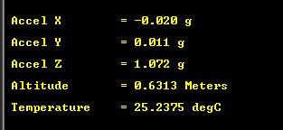

# NXP Application Code Hub

## 3-Axis Accelerometer and Pressure Sensor demo based on FRDM-MCXA153

- This demo shows how to configure the absolute pressure sensor MPL3115 (20 to 110 kPa) and the 3-axis accelerometer sensor FXLS8974CF (±2/4/8/16 g) by consuming the NXP Sensor ISSDK.
- The FXLS8974CF sensor is configured with the following settings.
  - FSR = 2g's (Full Scale Range)
  - Sensitivity of 0.98 mg/LSB. The Sensitivity depends on the FSR selected.
  - ODR = 6.25 Hz (Output Data Rate). Sensor Data Registers will be refreshed at a rate of 6.25Hz. This configuration results in low noise. The minimum ODR that can be set is 0.781 Hz, while the maximum is 3200 Hz. 
  
- The MPL3115 Absolute Pressure Sensor is configured with the following settings.
  - OSR = 2 (Output Sample Rate). The minimum Time Between Data Samples 10 ms.
  - Enable Data Ready and Event flags for Altitude, Temperature or either.
  - ALTITUDE or PRESSURE Mode depending on user selection (set Macro before compilation).

The demo consumes the captured data from XYZ axis of the accelerometer and processes those. See Results section.  

Refer to section 5 for more information about parts used for this demo.

#### Boards: FRDM-MCXA153
#### Accessories: mikroe_accel_pressure_click
#### Categories: Low Power, Sensor
#### Peripherals: I2C, UART
#### Toolchains: MCUXpresso IDE

## Table of Contents
1. [Software](#step1)
2. [Hardware](#step2)
3. [Setup](#step3)
4. [Results](#step4)
5. [Support](#step5)

## 1. Software
- IoT Sensing SDK (ISSDK) v1.8 offered as middleware in MCUXpresso SDK for supported platforms (https://www.nxp.com/design/design-center/software/sensor-toolbox/iot-sensing-software-development-kit-issdk-embedded-software-framework:IOT-SENSING-SDK)
- [MCXUpresso SDK 2.14.0 for FRDM-MCXA153](https://mcuxpresso.nxp.com/en/builder?hw=FRDM-MCXA153)
- [MCUXpresso IDE v11.9.0 or newer](https://www.nxp.com/design/design-center/software/development-software/mcuxpresso-software-and-tools-/mcuxpresso-integrated-development-environment-ide:MCUXpresso-IDE)
- Git v2.39.0
- Teraterm (https://github.com/TeraTermProject/teraterm/releases) or RealTerm (https://sourceforge.net/projects/realterm/)

## 2. Hardware
- [FRDM-MCXA153 board](https://www.nxp.com/part/FRDM-MCXA153)
- [Accel & Pressure click board](https://www.mikroe.com/accelpressure-click)
- Personal Computer
- Mini/micro C USB cable

## 3. Setup

### 3.1 Step 1: Download and Install required Software(s)
- Download and Install [MCUXpresso IDE 11.9.0 or newer](https://www.nxp.com/design/design-center/software/development-software/mcuxpresso-software-and-tools-/mcuxpresso-integrated-development-environment-ide:MCUXpresso-IDE?&tid=vanMCUXPRESSO/IDE) and Install following the installer instructions.
- Download and Install [MCXUpresso SDK 2.14.0 or newer for FRDM-MCXA153](https://mcuxpresso.nxp.com/en/builder?hw=FRDM-MCXA153) OR
- Install Git v2.39.0 or newer (for cloning and running west commands)
- Download and Install [RealTerm (for checking examples output)](https://osdn.net/projects/ttssh2/releases/)

### 3.2 Step 2: Clone the APP-CODE-HUB/dm-mcxa-accel-and-pressure-logger
- Open MCUXpresso IDE and select a directory to create your workspace.
- Install "MCXUpresso SDK 2.14.0 for FRDM-MCXA153" (drag and drop SDK zip into "Installed SDK" view) into MCUXpresso IDE.
- Click on "Import from Applications Code Hub" on QuickStart Panel to clone this demo directly.
- 
### 3.3 Step 3: Build example projects
- Once the project is imported, right click on its name and select build to start building.

### 3.4 Step 4: Run example projects
- Connect FRDM-MCXA153 with Accel&Pressure click board atop.
- Connect a USB cable between the host PC and the MCU-Link USB port on the target board.
- Right click on project and select "Debug As". Select MCUXpresso IDE LinkServer (inc. CMSIS DAP) probes.
- Open a serial terminal (RealTerm) with the following settings:
    - 115200 baud rate
    - 8 data bits
    - No parity
    - One stop bit
    - No flow control
- Launch the debugger in your IDE to begin running the demo.

## 4. Results
- The GREEN LED will blink at low rate when the response of the Z axis is higher than 1.2g's, this behavior is easily observed when the user grabs the board on hands. Note that GREEN LED is directly related to Z axis.
- On the other hand, XY axis are related with the RED and BLUE LED's respectively. Tilting the board over X or Y axis will cause the RED and BLUE LED to blink at rate that is function of the detected g level.
- The demo is able to run in standalone mode. However, the only way to read out the Pressure/Altitude measurements from MPL3115 sensor is by attaching a Serial Terminal Application.
- The pressure measurements will be shown in Pascals (Pa), while the altitude will be shown in meters.
See the following picture:
 

## 5. Support
- Reach out to NXP Sensors Community page for more support - [NXP Community](https://community.nxp.com/t5/forums/postpage/choose-node/true?_gl=1*fxvsn4*_ga*MTg2MDYwNjMzMy4xNzAyNDE4NzM0*_ga_WM5LE0KMSH*MTcwMjQxODczMy4xLjEuMTcwMjQxODczNi4wLjAuMA..)
- Learn more about MPL3115 pressure/altimeter sensor, refer to - [MPL3115 DS](https://www.nxp.com/docs/en/data-sheet/MPL3115A2S.pdf)
- Learn more about FLXS8974CF 3-axis accelerometer sensor, refer to - [FXLS8974CF DS](https://www.nxp.com/docs/en/data-sheet/FXLS8974CF.pdf)
- Accelerate your sensors development using Sensor ToolBox, refer to - [Sensors Development Ecosystem](https://www.nxp.com/design/design-center/software/sensor-toolbox:SENSOR-TOOLBOXX)

#### Project Metadata
<!----- Boards ----->

<!----- Categories ----->
 

<!----- Peripherals ----->
  

<!----- Toolchains ----->

Questions regarding the content/correctness of this example can be entered as Issues within this GitHub repository.

>**Warning**: For more general technical questions regarding NXP Microcontrollers and the difference in expected funcionality, enter your questions on the [NXP Community Forum](https://community.nxp.com/)

## 6. Release Notes
| Version | Description / Update                           | Date                        |
|:-------:|------------------------------------------------|----------------------------:|
| 1.0     | Initial release on Application Code Hub        | Jun 12th 2024 |

